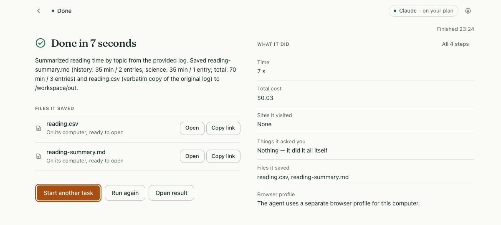
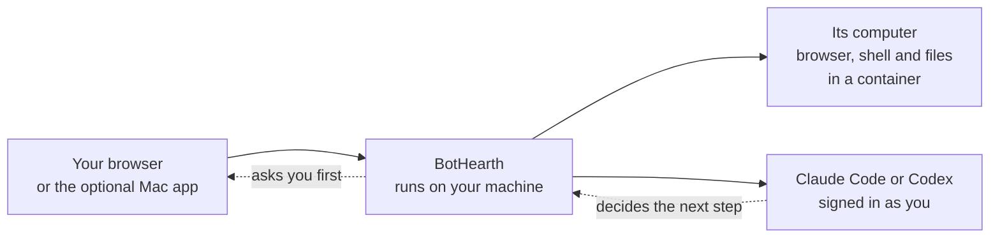

<p align="center">
  
</p>

<h1 align="center">BotHearth</h1>

<p align="center">Your AI agent. With a computer.</p>

<p align="center"><a href="https://bothearth.com/">Website</a> · <a href="https://bothearth.com/quickstart/">Quickstart</a> · <a href="https://bothearth.com/security/">Security and privacy</a></p>

<p align="center">
  <a href="https://github.com/sanjaygbhat/bothearth/actions/workflows/ci.yml"></a>
</p>

[](website/screenshots/reading-summary.png)

*An actual task using the [sample reading log](https://bothearth.com/examples/#workspace). Open the image for the complete capture; [capture details and usage meter](https://bothearth.com/about/#credits).*

## Run it

Give BotHearth a task: research a topic from pages you provide, compare your options, or turn a personal reading log into a summary. Your AI agent uses its computer to browse and work with files while you follow along. Review requests, take control when a site needs you, and open the results it saves.

One business bot is free under the limited-time perpetual [business permission](COMMERCIAL.md); additional business bots are US$49 each, once. You may sell the work it creates. Standard grants exclude resale and hosting of BotHearth or modified copies as a service. There is no BotHearth subscription or checkout. You supply the machine and an eligible model account; provider usage, electricity, and optional hosting can cost money. This release is source-available under PolyForm Noncommercial, which is **not an OSI open-source license**. See [license and cost questions](COMMERCIAL.md).

You need macOS or Linux, Node.js 22.18 or newer, a running container runtime, and either [Claude Code](docs/CLAUDE-CODE.md) or [Codex](docs/PROVIDERS.md) installed and authenticated on the host. Use Docker Engine on Linux; Docker Desktop, OrbStack, or Colima on macOS. Container runtimes have their own license terms; see the [quickstart](docs/QUICKSTART.md).

```bash
git clone https://github.com/sanjaygbhat/bothearth.git
cd bothearth
npm ci && npm run build
npm link            # puts `bothearth` and `modelbot` on your PATH
bothearth init       # press Enter at the passphrase prompt to use the OS keychain
bothearth start
```

The new command is `bothearth`; `modelbot` remains an alias for existing installations. Configuration (`~/.modelbot`), local `ModelBot` directories, image names, and `ModelBot.app` retain their original names for compatibility.

If you would rather not link the command globally, every `bothearth …` in these docs works as `node dist/cli/index.js …` from the checkout.

`start` prints a link and opens it in your browser. **The link works for 10 minutes and once only.** Lost it, or came back the next day? Run `bothearth pair` for a fresh one — that is also how you add a second browser or another device. Once you are in, that browser stays signed in as long as you use it at least once every 7 days and for at most 30 days from pairing, restarts of BotHearth included; after that, run `bothearth pair` for a new link.

In the browser: open **Settings → AI connection**, pick Claude Code or Codex, and sign in the normal way. Then type a task into the box on the home screen and press `⌘↩` (`Ctrl↩` on Linux).

The first task needs your bot's computer built once — several minutes and a few GB while it downloads Chromium and its Linux dependencies. The home screen starts that build for you; `bothearth image build` does the same thing from the terminal. There are no prebuilt images to pull yet.

### The Mac app, if you want a window

Optional. On macOS, `npm run app:mac` builds a native shell at `apps/macos/build/ModelBot.app` — the same BotHearth, in a window with menus and a dock icon instead of a browser tab. It starts the daemon itself, so there is no link to paste.

Builds from this checkout are ad-hoc signed, which means macOS refuses to let the app post notifications. Everything else in the "your bot needs you" loop works: the dock badge, the dock bounce, the menu-bar item and the in-window card. A Developer ID certificate fixes it — see [apps/macos/README.md](apps/macos/README.md).

[Quickstart](docs/QUICKSTART.md) walks through the whole thing, including your phone.

## What it does

- **Tasks run in separate containers on your machine.** The browser has its own login profile. The shell sees the configured workspace, which is a folder on your host; it does not get your everyday browser profile or home directory by default.
- **Review requests for sensitive actions.** BotHearth gates new destinations and detected sends, uploads, deletes, and payments. Ordinary browsing on approved sites and saving a result to the task workspace can proceed without another prompt. Detection and domain policy have limits; review tasks and results yourself.
- **You can take control at any time.** When a site wants a password or a code, press **Take control**, do it yourself, and hand it back. The live view goes full screen and says **You have control**. While you are driving, the model cannot see the screen or what you type. Sites you sign into stay signed in inside your bot's own browser from one task to the next; **Settings → Computers → Use a fresh one** throws that computer away and signs everything out.


  *While you drive, model capture is blocked. Press **Give control back** to resume after validation. Ten minutes without input pauses control; it does not automatically return the browser to the agent. Screenshots show a development build and may contain older labels.*
- **Connect your own model account.** BotHearth invokes your installed Codex or Claude Code CLI using its native authentication. It is independent of OpenAI and Anthropic. Provider terms, eligible plans, rate limits, and charges apply; see [provider requirements](docs/PROVIDERS.md).
- **Review a task's activity.** The task view records its steps, approved actions, visited sites, and saved results. Remote providers receive the model-visible task context; [privacy and retention](PRIVACY.md) explains what stays on the host and what is sent out.
- **Limit how much work a task may do.** The default meter is $20 with a default per-task ceiling of $100, configurable under **Settings → Usage**. Harness tasks count each computer tool call as an estimated cent: $20 represents 2,000 calls, not a provider bill. API usage estimates also depend on configured prices. These controls cannot enforce a hard cap on external charges. A task reaching its limit pauses and can be resumed with a higher allowance.

| Review a destination | Inspect a finished result |
|---|---|
|  |  |

*Unretouched app captures: the approval view is a pre-rename development build from 7 September 2026; the reading-log result is an actual sample task from 8 September. The dollar meter estimates tool usage, not a provider bill.*

## How it works



You drive it from an ordinary browser, or from the optional native macOS shell. BotHearth itself runs on your machine and holds the vault, the audit log and the approval gates. Your bot's computer is a container with no published ports and no Docker socket. The model never talks to the container directly — every step goes through BotHearth, which is where your approvals and your budget are enforced.

More detail: [architecture](docs/ARCHITECTURE.md) · [configuration](docs/CONFIG.md) · [CLI](docs/CLI.md) · [extending it](docs/EXTENDING.md)

## Status

Technical alpha, installed from source. The server version — the daemon and the web interface in your browser — runs on macOS and Linux. The Mac app is an optional shell over the same thing.

Not done yet:

- **No code signing or notarization.** Builds are ad-hoc signed, which means macOS refuses to let the app post notifications. Everything else in the "your bot needs you" loop works: the dock badge, the dock bounce, the menu-bar item and the in-window card. A Developer ID certificate fixes it; see [apps/macos/README.md](apps/macos/README.md).
- **No Windows build.** WSL2 is an experimental path without equivalent launch acceptance; there is no Windows app shell.
- **No published packages or signed images.** You build from this checkout.
- **Scheduled tasks** need a standalone provider rather than Claude Code or Codex.

Limits worth knowing before you rely on it. BotHearth is a single-operator runtime. Containers, approval gates and the keyed audit chain reduce risk; they do not stop every prompt injection, and they do not protect the host from a harness already running with your account's permissions. Domain egress policy is best effort, not a firewall. Browser profiles are stored unencrypted. Sites may block automation, and passkeys and hardware security keys generally do not work inside your bot's browser. See the [security model](SECURITY.md) for the trust boundaries.

## Licence

Source-available under [PolyForm Noncommercial 1.0.0](LICENSE). The unchanged repository licence defines permitted noncommercial uses; [the additional business permission](COMMERCIAL.md) allows one free business bot and commercial outputs. The optional [work-domain certificate](https://bothearth.com/enterprise/) records the same perpetual free entitlement. Additional business bots cost US$49 each, once. Neither standard grant includes commercial resale, sublicensing or customer-facing hosting of BotHearth, including modified copies. [COMMERCIAL.md](COMMERCIAL.md) explains the scope and [NOTICE](NOTICE) / [third-party notices](THIRD_PARTY_NOTICES.md) cover separately licensed components. Contributions are signed off under the [contributor licence agreement](CLA.md).

## Contributing

`npm ci && npm run build`, then `npm run typecheck` and `npm test`. The `computer-server` package carries its own dependencies — `npm ci --prefix computer-server --ignore-scripts` — which its unit tests and its own typecheck need; building and running BotHearth does not, because the image installs Playwright itself. Tests that touch containers need the images built. Start at [CONTRIBUTING.md](CONTRIBUTING.md).

[Security model and how to report a vulnerability](SECURITY.md) · [Privacy and retention](PRIVACY.md) · [Documentation](docs/README.md)
