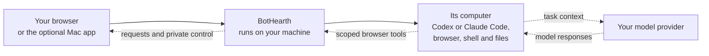

<p align="center">
  
</p>

<h1 align="center">BotHearth</h1>

<p align="center">Your AI agent. With a computer.</p>

<p align="center"><a href="https://bothearth.com/">Website</a> · <a href="https://bothearth.com/quickstart/">Quickstart</a> · <a href="https://bothearth.com/security/">Security and privacy</a></p>

<p align="center">
  <a href="https://github.com/sanjaygbhat/bothearth/actions/workflows/ci.yml"></a>
</p>

[](website/screenshots/email-inbox-redacted.png)

*Real email organisation test, 8 September 2026: **51 min 6 s across two runs**. Private inbox details blurred. [View the completed result](website/screenshots/email-organised-redacted.png).*

## Run it

Give BotHearth a task: research a topic from pages you provide, compare your options, or turn a personal reading log into a summary. Your AI agent uses its computer to browse and work with files while you follow along. Review requests, take control when a site needs you, and open the results it saves.

One business bot is free under the limited-time perpetual [business permission](COMMERCIAL.md); additional business bots are US$49 each, once. You may sell the work it creates. Standard grants exclude resale and hosting of BotHearth or modified copies as a service. There is no BotHearth subscription or checkout. You supply the machine and an eligible model account; provider usage, electricity, and optional hosting can cost money. This release is source-available under PolyForm Noncommercial, which is **not an OSI open-source license**. See [license and cost questions](COMMERCIAL.md).

You need macOS or Linux, Node.js 22.18 or newer, a running container runtime, and an eligible Codex or Claude Code account. The computer image includes both official CLIs; Settings signs you in inside the bot’s computer. Use Docker Engine on Linux; Docker Desktop, OrbStack, or Colima on macOS. Container runtimes have their own license terms; see the [quickstart](docs/QUICKSTART.md).

```bash
git clone https://github.com/sanjaygbhat/bothearth.git
cd bothearth
npm ci && npm run build
npm link            # puts `bothearth` and `modelbot` on your PATH
bothearth init       # uses the OS keychain
bothearth start
```

If you would rather not link the command globally, every `bothearth …` in these docs works as `node dist/cli/index.js …` from the checkout.

`start` prints a link and opens it in your browser. **The link works for 10 minutes and once only.** Lost it, or came back the next day? Run `bothearth pair` for a fresh one — that is also how you add a second browser or another device. Once you are in, that browser stays signed in as long as you use it at least once every 7 days and for at most 30 days from pairing, restarts of BotHearth included; after that, run `bothearth pair` for a new link.

In the browser: open **Settings → Model connection**, pick Claude Code or Codex, and complete its native sign-in. On Home, choose the provider and model (and Codex reasoning effort: low, medium or high), type a task, and press `⌘↩` (`Ctrl↩` on Linux). **Use subagents** is an unchecked checkbox for every new task; check it only when you want delegation, then choose a **Subagent model** if needed.

The first sign-in or task needs your bot's computer built once — several minutes and a few GB while it downloads Chromium, the native CLIs and their Linux dependencies. BotHearth offers that build for you; `bothearth image build` does the same thing from the terminal. There are no prebuilt images to pull yet.

### The Mac app, if you want a window

Optional. On macOS, `npm run app:mac` builds a native shell at `apps/macos/build/ModelBot.app` — the same BotHearth, in a window with menus and a dock icon instead of a browser tab. It starts the daemon itself, so there is no link to paste.

Builds from this checkout are ad-hoc signed, which means macOS refuses to let the app post notifications. Everything else in the "your bot needs you" loop works: the dock badge, the dock bounce, the menu-bar item and the in-window card. A Developer ID certificate fixes it — see [apps/macos/README.md](apps/macos/README.md).

[Quickstart](docs/QUICKSTART.md) walks through the whole thing, including your phone.

## What it does

- **Tasks run in separate containers on your machine.** The browser has its own login profile. The shell sees the configured workspace, which is a folder on your host; it does not get your everyday browser profile or home directory by default.
- **Review requests for sensitive actions.** BotHearth’s browser tools can gate detected sends, uploads, deletes and payments. Normal public browsing proceeds without destination prompts; strict mode restricts destinations. Native CLI commands have their own file and network access inside the container and do not pass through these MCP action checks.
- **Talk while it works.** Use **Message BotHearth** to ask a question or change direction during a task. Messages reach the runner at its next opportunity; an action already in progress may finish first. During private control, guest processes are frozen and messages wait for their return.
- **You can take control at any time.** When a site wants a password or a code, press **Take control**, do it yourself, and hand it back. Takeover opens the full bot desktop, including browser windows, Files and Terminal, while keeping the conversation visible. Full screen is optional. Native model processes are frozen and model observation is blocked before human control is acknowledged. Sites you sign into stay signed in inside your bot's own browser from one task to the next; **Settings → Computers → Use a fresh one** replaces that computer and its browser logins.


  *While you drive, model capture is blocked. Press **Give control back** to resume after validation. Ten minutes without input pauses control; it does not automatically return the browser to the agent. Screenshots show a development build and may contain older labels.*
- **Connect your own model account.** BotHearth runs the official Codex or Claude Code CLI inside the bot’s computer using its native authentication. It is independent of OpenAI and Anthropic. Provider terms, eligible plans, rate limits, and charges apply; see [provider requirements](docs/PROVIDERS.md).
- **Review a task's activity.** The task view records its selected model, steps, visited sites, and saved results. **Model messages** toggles narration while keeping tools, your messages and the result visible. Send a message to clarify the task; during human control it waits until you return control. **Read full result** expands a shortened result, and **Copy result** copies the loaded text. Remote providers receive the model-visible task context; [privacy and retention](PRIVACY.md) explains what stays on the host and what is sent out.
- **See the task’s total cost estimate.** Harness tasks count each computer tool call as an estimated cent; this is not a provider bill. API usage estimates also depend on configured prices. Internal task limits remain as a safety control and cannot enforce a hard cap on external charges.

| Review a destination | Inspect a finished result |
|---|---|
|  |  |

*Actual app captures: the approval view is a pre-rename build from 7 September 2026; the email result is the completed continuation from 8 September, with private and obsolete internal details blurred. The dollar meter estimates tool usage, not a provider bill.*

## How it works



You drive it from an ordinary browser, or from the optional native macOS shell. The host daemon holds the vault, task records and MCP approval gates. New native sessions run inside the computer, with no published ports or Docker socket; their stock shell and network tools remain available. Historical host sessions resume on the host with their original CLI login and conversation. MCP approvals and usage estimates cover calls through BotHearth, not every native tool operation.

More detail: [architecture](docs/ARCHITECTURE.md) · [configuration](docs/CONFIG.md) · [CLI](docs/CLI.md) · [extending it](docs/EXTENDING.md)

## Status

Technical alpha, installed from source. The server version — the daemon and the web interface in your browser — runs on macOS and Linux. The Mac app is an optional shell over the same thing.

Not done yet:

- **No code signing or notarization.** Builds are ad-hoc signed, which means macOS refuses to let the app post notifications. Everything else in the "your bot needs you" loop works: the dock badge, the dock bounce, the menu-bar item and the in-window card. A Developer ID certificate fixes it; see [apps/macos/README.md](apps/macos/README.md).
- **No Windows build.** WSL2 is an experimental path without equivalent launch acceptance; there is no Windows app shell.
- **No published packages or signed images.** You build from this checkout.
- **Scheduled tasks** need a standalone provider rather than Claude Code or Codex.

Limits worth knowing before you rely on it. BotHearth is a single-operator runtime. Containers, approval gates and the keyed audit chain reduce risk; they do not stop every prompt injection. Historical host sessions and separately connected harnesses retain their host permissions. Domain egress policy is best effort, not a firewall. Browser profiles are stored unencrypted. Sites may block automation, and passkeys and hardware security keys generally do not work inside your bot's browser. See the [security model](SECURITY.md) for the trust boundaries.

## Licence

Source-available under [PolyForm Noncommercial 1.0.0](LICENSE). The unchanged repository licence defines permitted noncommercial uses; [the additional business permission](COMMERCIAL.md) allows one free business bot and commercial outputs. The optional [work-domain certificate](https://bothearth.com/enterprise/) records the same perpetual free entitlement. Additional business bots cost US$49 each, once. Neither standard grant includes commercial resale, sublicensing or customer-facing hosting of BotHearth, including modified copies. [COMMERCIAL.md](COMMERCIAL.md) explains the scope and [NOTICE](NOTICE) / [third-party notices](THIRD_PARTY_NOTICES.md) cover separately licensed components. Contributions are signed off under the [contributor licence agreement](CLA.md).

## Contributing

`npm ci && npm run build`, then `npm run typecheck` and `npm test`. The `computer-server` package carries its own dependencies — `npm ci --prefix computer-server --ignore-scripts` — which its unit tests and its own typecheck need; building and running BotHearth does not, because the image installs Playwright itself. Tests that touch containers need the images built. Start at [CONTRIBUTING.md](CONTRIBUTING.md).

[Security model and how to report a vulnerability](SECURITY.md) · [Privacy and retention](PRIVACY.md) · [Setup guide](docs/QUICKSTART.md)
