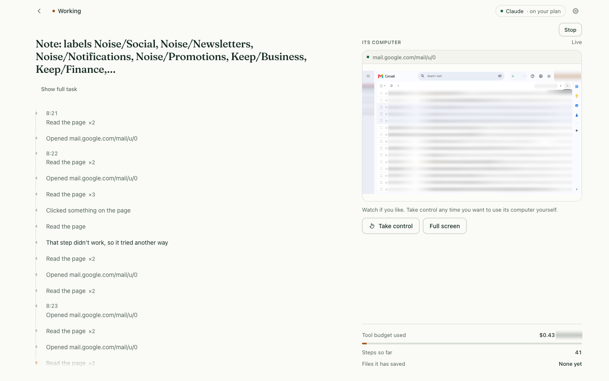
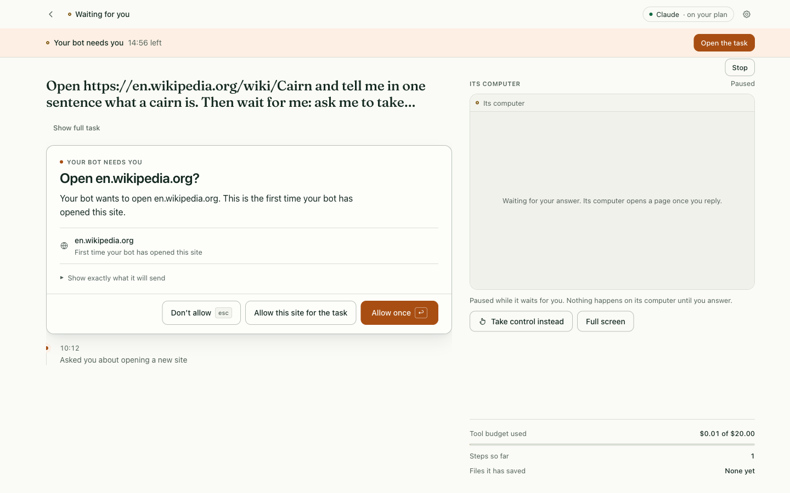
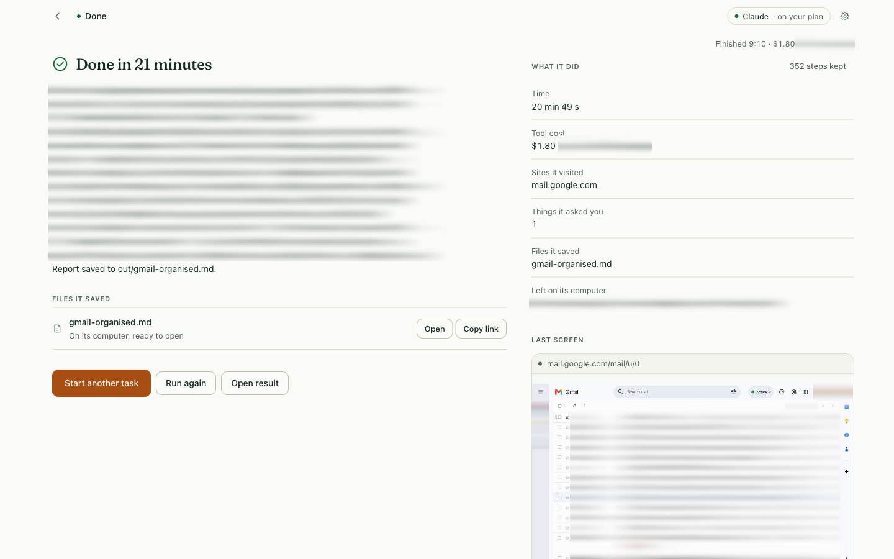
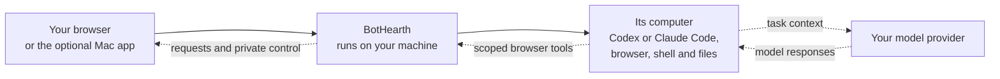

<p align="center">
  
</p>

<h1 align="center">Your AI agent. Your infrastructure.</h1>

<p align="center">Source-available (PolyForm Noncommercial, not OSI open source). Alpha. Mac or Linux with Docker.</p>

<p align="center"><a href="https://bothearth.com/">Website</a> · <a href="https://bothearth.com/quickstart/">Quickstart</a> · <a href="https://bothearth.com/security/">Security and privacy</a></p>

<p align="center">
  <a href="https://github.com/sanjaygbhat/bothearth/actions/workflows/ci.yml"></a>
</p>

[](website/screenshots/email-inbox-redacted.png)

*Real email organisation test, 8 September 2026: **51 min 6 s across two runs**. Private inbox details blurred. [View the completed result](website/screenshots/email-organised-redacted.png).*

## Run it

**What it is**

- An AI agent with its own Linux computer (browser, shell, files) on a Mac, Linux host, or VM you run.
- Native path: Codex (verified live) or Claude Code (listed; not yet verified live). API adapters and local endpoints are configured in YAML.
- Workspace, task records, and the browser profile stay on this computer’s volume.

**What it is not**

- Not OSI open source. Source-available under PolyForm Noncommercial, plus a limited business-and-output permission.
- Not a BotHearth cloud, spend cap, or call cap. A task runs until done, until you stop it, or until your model subscription’s usage limit is reached.
- Not a promise that prompts stay on the host. Remote models still receive the task context you send.

Give BotHearth a task. It browses and works with files on its computer. A task runs on its own and pauses when a site needs you — password, OTP, passkey, CAPTCHA, or a payment-card field. Take control, then open the results it saves.

One business bot is free under the limited-time perpetual [business permission](COMMERCIAL.md); additional bots are US$49 each, once. You may sell the work it creates. Standard grants exclude resale and hosting of BotHearth as a service. There is no BotHearth subscription. You supply the machine and an eligible model account. This release is source-available under PolyForm Noncommercial, which is **not an OSI open-source license**.

You need macOS or Linux, Node.js 22.18 or newer, a running container runtime, and an eligible Codex or Claude Code account. Settings signs you in inside the bot’s computer. Use Docker Engine on Linux; Docker Desktop, OrbStack, or Colima on macOS. See the [quickstart](docs/QUICKSTART.md).

```bash
git clone https://github.com/sanjaygbhat/bothearth.git
cd bothearth
npm ci && npm run build
npm link            # puts `bothearth` and `modelbot` on your PATH
bothearth init       # uses the OS keychain
bothearth start
```

Without a global link, every `bothearth …` works as `node dist/cli/index.js …` from the checkout.

`start` prints a link that works for **10 minutes and once only.** Run `bothearth pair` for a fresh one, or to add another browser. A paired browser stays signed in with a 7-day inactivity timeout and a 30-day maximum.

Open **Settings → Model connection**, pick Codex or Claude Code, and complete native sign-in. On Home, choose provider and model, type a task, press `⌘↩` (`Ctrl↩` on Linux). **Use subagents** is unchecked for every new task.

The first sign-in or task builds the computer once — several minutes and a few GB. `bothearth image build` does the same from the terminal. No prebuilt images yet.

Optional on macOS: `npm run app:mac` builds `apps/macos/build/ModelBot.app`. Ad-hoc signed, so macOS refuses notifications; dock badge, bounce, menu-bar item and in-window card still work. See [apps/macos/README.md](apps/macos/README.md).

## What it does

- **Each computer has its own containers; successive tasks can reuse its browser profile and workspace.** The browser profile persists on the computer's volume; a fresh computer starts clean. The shell sees the configured workspace folder on your host, not your everyday browser or home directory.
- **Review prompts are off by default.** Optional **Settings → Sensitive actions → Ask before sensitive actions** reviews detected sends, uploads, deletes, checkout steps, and new-site form submits through BotHearth’s browser tools. Expand the section to choose which gates fire, and to set API-adapter max tool calls and spend cap (0 = no limit); native Codex and Claude Code tasks have no BotHearth cap. Native CLI shell and network tools bypass those MCP checks. Detection is incomplete.
- **Take control** when a site wants a password, OTP, passkey, CAPTCHA, or a payment-card field. It opens the full bot desktop and requests full screen; Esc leaves full screen without returning control. Model processes freeze and capture is blocked before control is acknowledged. **Give control back** resumes after validation. Ten minutes idle pauses control; it does not hand the browser back to the agent.
- **Message BotHearth** while it works. Messages wait during private control.
- **Connect your own model account.** Codex is verified live; Claude Code is listed, not yet verified live. Independent of OpenAI and Anthropic. Provider terms apply; see [provider requirements](docs/PROVIDERS.md).
- **The receipt shows an estimate of tool use, not a bill.** Default: one estimated cent per BotHearth MCP computer-tool call. No BotHearth spend cap or call cap. A provider usage limit pauses the task; it can resume.

### You control

Remote models still receive the task context you send.

| You control | In this alpha |
|---|---|
| **Machine** | Daemon on your Mac, Linux host, or VM. Browser, shell, and proxy containers. No BotHearth-hosted agent account. Laptop sleep stops local work. |
| **Model account** | Codex (verified live) or Claude Code (listed; not yet verified live). [API adapters and local endpoints](docs/PROVIDERS.md) in YAML. BotHearth does not sell tokens. |
| **Data location** | Workspace, task records, audit chain, and browser profile on this computer’s volume. A fresh computer starts clean. |
| **Review prompts** | Off by default. **Settings → Sensitive actions → Ask before sensitive actions** covers detected BotHearth-tool sends, uploads, deletes, checkout steps, and new-site form submits. Per-gate checkboxes and API-adapter limits (max tool calls, spend cap; 0 = no limit) are in the same pane; native Codex and Claude Code tasks have no BotHearth cap. Native CLI bypasses those checks. Detection incomplete. |
| **Credentials / takeover** | Password, OTP, passkey, CAPTCHA, payment-card fields: **Take control**. You type; model frozen; capture blocked. Full screen on take-over; Esc leaves it. Passkeys generally fail. Checkout steps without a card field are optional review prompts. |
| **Stopping** | Stop ends the task. `bothearth stop` stops the daemon. No BotHearth spend cap or call cap. Closing the window is not Stop. |
| **Network** | Public web via the egress proxy. Strict mode restricts destinations. Policy is best-effort, not a firewall. |

| Optional review prompt | Inspect a finished result |
|---|---|
|  |  |

*The review-prompt view is a pre-rename build from 7 September 2026; the email result is the 8 September continuation, with private details blurred. The receipt estimates tool usage, not a provider bill.*

## How it works



The host daemon holds the vault, task records and optional review prompts. New native sessions run inside the computer. Historical host sessions resume on the host with their original CLI login. MCP review prompts and usage estimates cover calls through BotHearth, not every native tool.

[architecture](docs/ARCHITECTURE.md) · [configuration](docs/CONFIG.md) · [CLI](docs/CLI.md) · [extending it](docs/EXTENDING.md)

## Status

This is v0.0.1 alpha, installed from source. You need macOS or Linux, Node.js 22.18 or newer, a container runtime, and your own Codex or Claude Code login. Claude Code is listed but not yet verified live. There is no `npx` install, no signed Mac app, no Windows build, and no BotHearth cloud. The first computer image is a multi-minute, multi-GB build. Sites will block automation. One business installation is free for your own work, including paid client deliverables; the code is source-available under PolyForm Noncommercial, which is **not** OSI open source.

Not done yet: no code signing or notarization; no Windows build (WSL2 is experimental); no published packages or signed images; scheduled tasks need a standalone provider rather than Claude Code or Codex.

BotHearth is a single-operator runtime. Containers, optional review prompts and the keyed audit chain reduce risk; they do not stop every prompt injection. Domain egress policy is best effort. Browser profiles are unencrypted. Passkeys generally do not work inside the bot browser. See the [security model](SECURITY.md).

## Licence

Source-available under [PolyForm Noncommercial 1.0.0](LICENSE). [The additional business permission](COMMERCIAL.md) allows one free business bot and commercial outputs. The optional [work-domain certificate](https://bothearth.com/enterprise/) records the same grant; certificate issuance is not open yet. Additional bots cost US$49 each, once. Standard grants exclude commercial resale, sublicensing or customer-facing hosting of BotHearth. Contributions are signed off under the [CLA](CLA.md).

## Contributing

`npm ci && npm run build`, then `npm run typecheck` and `npm test`. `computer-server` has its own dependencies for its unit tests. Tests that touch containers need the images built. Start at [CONTRIBUTING.md](CONTRIBUTING.md).

[Security](SECURITY.md) · [Privacy](PRIVACY.md) · [Setup](docs/QUICKSTART.md)
