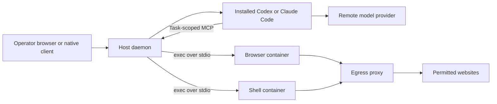

# Architecture

BotHearth runs an operator-controlled daemon on a Mac or Linux host and gives tasks a separate browser, shell, and workspace in containers. This page describes the source implementation reviewed on 2026-09-08; [configuration](CONFIG.md) and [CLI reference](CLI.md) are generated from the schema and commands.

## Where work runs



The host daemon serves the UI, operator API, live WebSockets, and MCP on one listener, normally `127.0.0.1:7777`. It also owns task state, policy, container lifecycle, the vault, and audit logging. It is not a container with the Docker socket mounted inside it. Remote installation keeps the daemon on the VM host and uses private HTTPS or an SSH tunnel; see [remote deployment](REMOTE-DEPLOY.md).

Each computer has a browser container, a shell container, and a proxy. The browser owns a persistent profile volume. Both browser and shell can access the configured host workspace; the shell does not mount the browser profile. Sandbox ports are not published. An internal container network and proxy provide the intended outbound route. Domain controls are best effort and do not inspect encrypted request content.

## Task execution

The ordinary task interface uses the user's installed Codex or Claude Code CLI. The CLI authenticates through the provider's native flow and connects to a task-scoped BotHearth MCP endpoint. The daemon validates the task, tool arguments, control state, permissions, and usage allowance before dispatching a computer action.

Manual harness connections use the separately configured MCP interface and an operator-created task binding. Standalone tasks use an adapter in `src/adapters/`; scheduled tasks currently require this standalone path. Model/tool-call compatibility and provider terms still apply. See [provider requirements](PROVIDERS.md) and [harness integrations](HARNESS-INTEGRATIONS.md).

The computer-server uses Playwright and Chromium for browser actions and snapshots. Live view is relayed through the daemon to authenticated operators. Shell and file tools run in the shell role, with file paths confined to the workspace. A successful model process exit does not finish a task: it must report completion through BotHearth's `done` tool.

## Approval and human control

Operator UI sessions and model MCP tokens have different authority. The MCP credential cannot grant operator approvals or watch human-control frames. Approvals bind the task, action, destination, control epoch, and expiry. New destinations and detected sensitive effects may request approval; ordinary allowed interactions and task-result writes can proceed without another prompt. Classification can miss effects.

Human takeover blocks model capture and ordinary agent actions before the UI grants control. The operator receives live frames and can send input. The site still receives that input. Handback validates the page before capture resumes; an expired lease enters a paused state, never automatic agent control.

## State and costs

Task history and sessions use host SQLite storage. The vault encrypts provider keys and connector environment values; browser profiles, workspaces, and task databases are not encrypted by BotHearth. The keyed audit chain detects some changes to saved records, not every compromise of a host holding its key. Native harness histories and runner logs are additional stores. See [privacy and removal](../PRIVACY.md).

Harness usage is estimated from tool calls. Standalone API estimates depend on reported usage and configured prices. Task limits can pause work but cannot guarantee a cap on a provider's bill. See [quickstart limits](QUICKSTART.md#what-a-task-is-allowed-to-spend).

## Integration contracts

The canonical catalogue is [TOOL_NAMES and shared contracts](https://github.com/sanjaygbhat/bothearth/blob/main/src/types/contracts.ts), with argument schemas under [src/tools/schemas](https://github.com/sanjaygbhat/bothearth/tree/main/src/tools/schemas). The current tools are:

```text
browser_navigate browser_snapshot browser_click browser_type browser_press
browser_scroll browser_select browser_upload browser_tabs browser_screenshot
browser_wait computer_mouse computer_key computer_type shell_exec
files_list files_read files_write files_delete write_file
request_takeover takeover_status connector_call done
```

Use the returned `snapshot_id` with reference-based actions. A stale reference requires a fresh snapshot. Pointer coordinates use CSS viewport pixels, not screenshot/device pixels. File/upload paths are confined to the workspace. Errors use the shared `ToolResult` envelope; transport JSON-RPC failures are separate from application error codes. [Extending BotHearth](EXTENDING.md) describes providers, connectors, and policy; do not infer a new tool from a name in an old design note.

The daemon/computer stream uses a four-byte big-endian body length, then a type byte and payload: `0` for UTF-8 JSON-RPC, `1` for binary live frames. The body limit is 8 MiB and JSON-RPC JSON limit 2 MiB. Browser role accepts RPC/live frames; shell role rejects live frames. Use the actual [stdio codec](https://github.com/sanjaygbhat/bothearth/blob/main/src/protocol/stdio.ts) and [live codec](https://github.com/sanjaygbhat/bothearth/blob/main/src/protocol/live.ts), which have contract tests. This private transport is distinct from the external MCP protocol.

| Endpoint family | Authority and purpose |
|---|---|
| `GET /healthz` | Unauthenticated liveness only |
| `/api/v1/session/*` | Bootstrap, pairing, device revocation; exact requests and credential storage in [remote client contract](REMOTE-CLIENT.md) |
| `/mcp` | MCP bearer, with browser origins rejected; [harness setup and task bindings](HARNESS-INTEGRATIONS.md) |
| `/api/v1/tasks`, `/api/v1/computers` | Authenticated operator administration; mutation requires CSRF |
| `/api/v1/approvals`, `/api/v1/takeover/*` | Operator decisions and human control; model credentials cannot approve |
| `/api/v1/events`, `/api/v1/live/:computerId` | Operator WebSockets with session/origin checks; control epoch must be preserved |
| `/api/v1/runtime`, `/api/v1/runtime/prepare` | Runtime readiness and operator-triggered image preparation |

For full request validation, read [daemon/server.ts](https://github.com/sanjaygbhat/bothearth/blob/main/src/daemon/server.ts). This pre-release API is not a version-stability promise. Runtime readiness checks the actual Node version, runtime, stamped images, browser, and configured model connection; the home screen can open before task execution is ready. [Troubleshooting](TROUBLESHOOTING.md) maps the visible blockers to recovery actions.

Each vault file has its own OS-store key identity derived from its real path, so resetting one installation does not intentionally rotate another's key. [Keychain and recovery details](https://github.com/sanjaygbhat/bothearth/blob/main/src/vault/KEYCHAIN.md) cover legacy keys and host ACL limits. [Compose](COMPOSE.md), [security](../SECURITY.md), and [release verification](SECURITY-CHECKLIST.md) retain the sandbox invariants and checks.

## Code map

| Path | Responsibility |
|---|---|
| `src/cli/`, `src/config/` | Commands, initialization, generated config defaults |
| `src/daemon/` | HTTP API, task state, runners, dispatch, connections |
| `src/policy/`, `src/protocol/` | Approval decisions, origin checks, control state |
| `src/sandbox/`, `src/proxy/` | Container lifecycle, runtime flags, outbound proxy |
| `computer-server/src/` | Browser and shell tool implementations |
| `src/mcp/`, `src/adapters/` | Harness transport, connectors, standalone models |
| `src/vault/`, `src/audit/` | Encrypted vault and audit chain |
| `src/ui/`, `apps/macos/`, `mobile/` | Browser UI and optional native clients |

Read [security](../SECURITY.md) before changing a trust boundary, [current decisions](DECISIONS.md) for constraints, and [contributing](../CONTRIBUTING.md) for validation.
